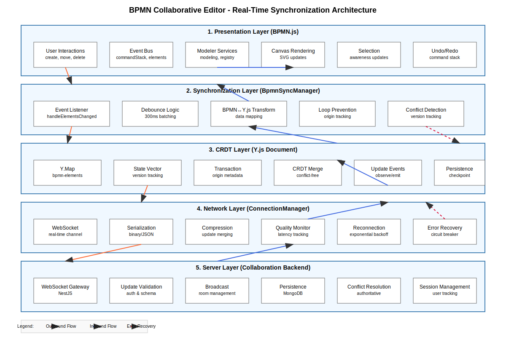
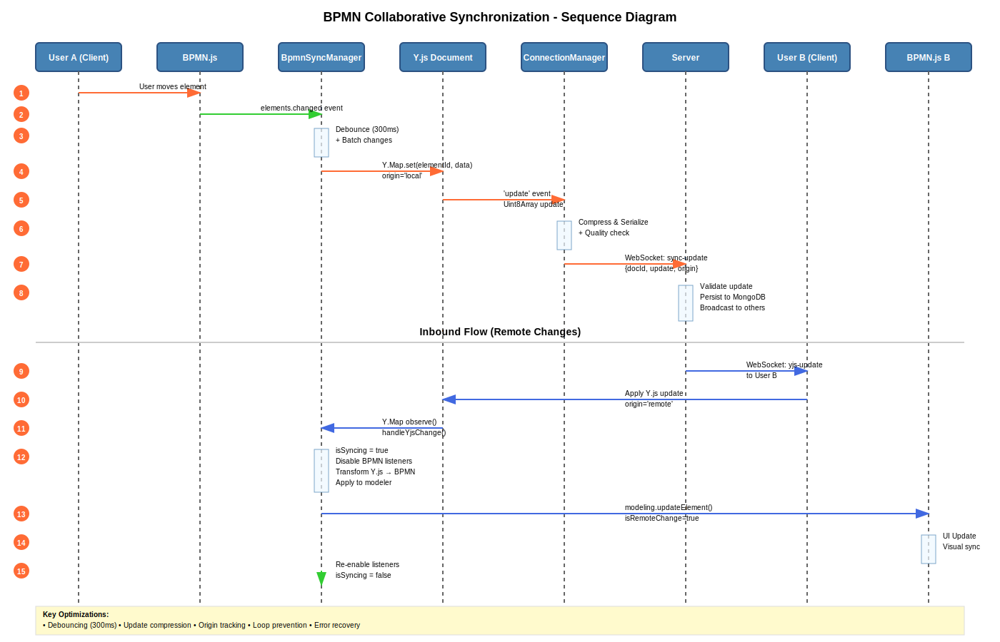
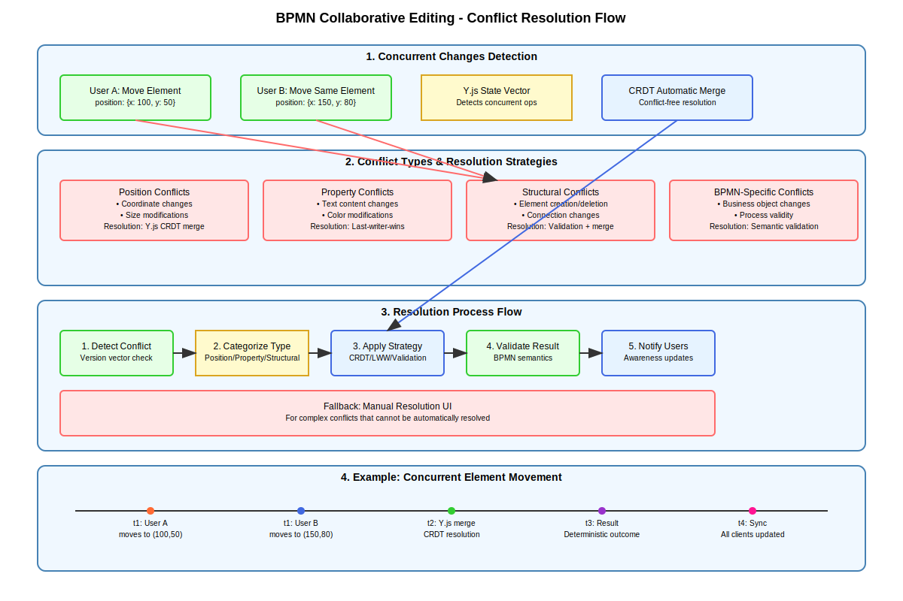

# BPMN Collaborative Editor - Comprehensive Design Document

## Executive Summary

This document presents a comprehensive architectural design for real-time collaborative BPMN editing, based on extensive analysis of BPMN.js architecture, Y.js CRDT mechanisms, and modern collaborative editing patterns. The design leverages proven patterns from industry leaders like Figma and Eclipse GLSP while addressing the specific challenges of collaborative diagram editing.

## Table of Contents

1. [Architecture Overview](#architecture-overview)
2. [BPMN.js Integration Analysis](#bpmnjs-integration-analysis)  
3. [Y.js CRDT Implementation Strategy](#yjs-crdt-implementation-strategy)
4. [Real-Time Synchronization Design](#real-time-synchronization-design)
5. [Conflict Resolution Mechanisms](#conflict-resolution-mechanisms)
6. [Performance Optimization Strategy](#performance-optimization-strategy)
7. [Error Recovery & Resilience](#error-recovery--resilience)
8. [Implementation Recommendations](#implementation-recommendations)
9. [Future Enhancements](#future-enhancements)

## Architecture Overview

### Five-Layer Architecture

The collaborative BPMN editor follows a layered architecture that separates concerns and enables scalable real-time collaboration:

**1. Presentation Layer (BPMN.js)**
- User interaction handling and visual rendering
- Canvas management and element manipulation
- Event emission through BPMN.js EventBus

**2. Synchronization Layer (BpmnSyncManager)**
- Bidirectional sync between BPMN.js and Y.js
- Event transformation and data mapping
- Loop prevention and consistency management

**3. CRDT Layer (Y.js Document)**
- Conflict-free replicated data structures
- Automatic merge conflict resolution
- State vector management for efficient sync

**4. Network Layer (ConnectionManager)**
- WebSocket-based real-time communication
- Update compression and serialization
- Connection quality monitoring and recovery

**5. Server Layer (Collaboration Backend)**
- Update validation and broadcasting
- Persistent storage and session management
- Authoritative conflict resolution

### Key Design Principles

- **Strong Eventual Consistency**: All clients converge to the same state
- **Causality Preservation**: Changes maintain logical order relationships
- **Performance First**: Sub-100ms response times for local operations
- **Fault Tolerance**: Graceful degradation under network issues
- **Scalability**: Support for 50+ concurrent collaborators per document

## BPMN.js Integration Analysis

### Event System Architecture

BPMN.js provides a rich event system that we leverage for collaboration:

**Core Events for Synchronization:**
- `commandStack.execute`: Captures all user actions
- `commandStack.revert`: Handles undo operations  
- `elements.changed`: Batch element modifications
- `selection.changed`: User awareness tracking

**Services Integration:**
- **ElementRegistry**: Central element storage and retrieval
- **Modeling**: High-level element manipulation API
- **CommandStack**: Undo/redo and transaction management
- **EventBus**: Pub/sub communication backbone

### Bidirectional Sync Challenges

**Challenge 1: Infinite Loop Prevention**
- Solution: Origin tracking with 'local' vs 'remote' markers
- Implementation: Transaction origin metadata in Y.js

**Challenge 2: Event Granularity**
- Solution: Debouncing rapid changes (300ms window)
- Implementation: Lodash debounce in BpmnSyncManager

**Challenge 3: Consistency During Remote Updates**
- Solution: Temporary listener disabling during sync
- Implementation: `isApplyingRemoteChanges` flag

## Y.js CRDT Implementation Strategy

### Data Structure Design

**Primary Container: Y.Map('bpmn-elements')**
```javascript
{
  [elementId]: {
    id: string,
    type: string,
    businessObject: Y.Map,
    di: Y.Map,
    parent: string,
    children: Y.Array<string>,
    x: number,
    y: number,
    width: number,
    height: number,
    // ... other properties
  }
}
```

**Benefits of Y.Map Structure:**
- Fine-grained conflict resolution at property level
- Efficient serialization and network transmission
- Automatic handling of concurrent property changes
- Support for nested Y.js types for complex objects

### CRDT Conflict Resolution

**1. Position Conflicts**
- Automatic coordinate merging using Y.js semantics
- Last-writer-wins for simple numeric properties
- Deterministic resolution based on client IDs

**2. Property Conflicts**
- Y.Map handles concurrent property updates
- Complex objects use nested Y.Map structures
- Rich-text properties leverage Y.Text type

**3. Structural Conflicts**
- Element creation: Unique IDs prevent conflicts
- Element deletion: Tombstone approach for consistency
- Connection validation: Endpoint existence checks

### Performance Optimizations

**Update Batching:**
- Merge sequential updates using `Y.mergeUpdates()`
- State vector diffing for minimal data transfer
- Binary encoding for efficient network transmission

**Memory Management:**
- Configurable garbage collection (`doc.gc = false` during sync)
- Periodic cleanup of obsolete operations
- Document checkpointing for large diagrams

## Real-Time Synchronization Design


### Outbound Flow (Local → Remote)

1. **User Action** → BPMN.js event emission
2. **Event Capture** → BpmnSyncManager listener
3. **Debouncing** → 300ms batching window
4. **Data Transform** → BPMN element to Y.js structure
5. **Y.js Update** → CRDT state modification
6. **Network Send** → Compressed binary transmission
7. **Server Broadcast** → Validation and relay to peers

### Inbound Flow (Remote → Local)

1. **Server Event** → WebSocket 'yjs-update' reception
2. **Y.js Apply** → CRDT merge with origin='remote'
3. **Change Detection** → Y.Map observe() callback
4. **Sync Control** → Disable BPMN listeners temporarily
5. **Transform Apply** → Y.js to BPMN.js data mapping
6. **Visual Update** → Modeler state modification
7. **Listener Restore** → Re-enable event handling

### Timing and Performance

**Target Performance Metrics:**
- Local response: < 50ms
- Network propagation: < 200ms
- Conflict resolution: < 100ms
- Full sync convergence: < 500ms

**Optimization Techniques:**
- Operation debouncing (300ms)
- Update compression
- Selective rendering
- Background persistence

## Conflict Resolution Mechanisms

### Conflict Classification

**1. Harmless Conflicts (Auto-resolve)**
- Position changes: Y.js automatic merge
- Simple property updates: Last-writer-wins
- Element creation: Unique ID prevention

**2. Semantic Conflicts (Validation required)**
- Connection endpoint changes
- BPMN type modifications
- Business object integrity

**3. Complex Conflicts (User intervention)**
- Simultaneous major restructuring
- Incompatible BPMN model changes
- Version divergence scenarios

### Resolution Strategies

**Automatic Resolution:**
- CRDT properties for conflict-free merging
- Vector clocks for causality ordering
- Deterministic tie-breaking using client IDs

**Semi-Automatic Resolution:**
- Validation rules for BPMN semantics
- Connection integrity preservation
- Business object consistency checks

**Manual Resolution:**
- Conflict notification UI
- Side-by-side comparison views
- User-guided merge tools

## Performance Optimization Strategy

### Network Optimization

**Update Compression:**
- Y.js update merging before transmission
- Binary encoding over JSON
- State vector diffing for incremental sync

**Connection Management:**
- WebSocket connection pooling
- Quality monitoring and adaptive behavior
- Graceful degradation for poor connections

### Client-Side Optimization

**Rendering Performance:**
- Batch DOM updates in single transaction
- Selective re-rendering of changed elements
- Virtual rendering for large diagrams
- Canvas viewport-based optimization

**Memory Management:**
- Periodic Y.js document cleanup
- Update history pruning
- Element version tracking cleanup
- JavaScript garbage collection optimization

### Server-Side Optimization

**Scalability Measures:**
- In-memory state for active documents
- Periodic persistence (30-60 second intervals)
- Room-based client grouping
- Load balancing across server instances

## Error Recovery & Resilience

### Connection-Level Recovery

**Automatic Reconnection:**
- Exponential backoff algorithm
- Maximum 5 reconnection attempts
- State synchronization after reconnection
- Offline operation support with local persistence

**Quality Monitoring:**
- Latency tracking (ping/pong mechanism)
- Connection quality classification
- Adaptive behavior based on network conditions
- Circuit breaker pattern for overloaded servers

### Data Consistency Recovery

**Validation Mechanisms:**
- Update integrity checking
- BPMN schema validation
- Business object consistency verification
- Element ID uniqueness enforcement

**Recovery Procedures:**
- Rollback to last known good state
- Server-side authoritative resolution
- Client-side consistency validation
- Manual conflict resolution UI

### Graceful Degradation

**Performance Degradation:**
- Rate limiting for excessive updates
- Priority queuing during high load
- Read-only mode during critical issues
- Background sync for non-critical updates

## Implementation Recommendations

### Phase 1: Core Infrastructure
1. Enhance BpmnSyncManager with robust error handling
2. Implement comprehensive Y.js data structure
3. Add connection quality monitoring
4. Create basic conflict resolution UI

### Phase 2: Performance Optimization
1. Implement update batching and compression
2. Add selective rendering optimizations
3. Create memory management systems
4. Optimize server-side persistence

### Phase 3: Advanced Features
1. Implement awareness features (cursors, selections)
2. Add advanced conflict resolution
3. Create collaboration analytics
4. Implement offline support

### Technical Considerations

**Testing Strategy:**
- Unit tests for CRDT operations
- Integration tests for sync flows
- Load testing for concurrent users
- Network simulation for edge cases

**Monitoring & Observability:**
- Real-time collaboration metrics
- Performance monitoring dashboards
- Error tracking and alerting
- User experience analytics

## Future Enhancements

### Advanced Collaboration Features
- **Real-time Awareness**: Live cursors and selections
- **Collaborative Comments**: Threaded discussions on elements
- **Change Tracking**: Visual diff and version history
- **Role-based Permissions**: Fine-grained access control

### Performance Improvements
- **WebRTC P2P**: Direct peer-to-peer synchronization
- **Operational Transform**: Hybrid OT+CRDT approach
- **Edge Computing**: CDN-based collaboration servers
- **Mobile Optimization**: Touch-friendly collaborative editing

### Enterprise Features
- **Audit Logging**: Complete change history tracking
- **Compliance Tools**: Regulatory requirement support
- **Integration APIs**: Third-party system connectivity
- **Advanced Analytics**: Collaboration insights and reporting

## Conclusion

This comprehensive design provides a robust foundation for real-time collaborative BPMN editing. By leveraging proven CRDT technology, modern web technologies, and battle-tested architectural patterns, the system achieves the key goals of performance, consistency, and scalability.

The layered architecture ensures maintainability and extensibility, while the comprehensive error recovery mechanisms provide reliability in production environments. The phased implementation approach allows for iterative development and validation of core concepts before adding advanced features.

The design successfully addresses the unique challenges of collaborative diagram editing while maintaining the flexibility to evolve with changing requirements and emerging technologies.

---

*Document Version: 1.0*  
*Last Updated: 2025-01-12*  
*Author: Claude (AI Assistant)*  
*Based on: BPMN.js analysis, Y.js research, and collaborative editing best practices*

---
## 몽고DB 컬렉션

  기본 컬렉션(설계 필요):
  - authlogs, bin_documents, documenthistories, documents, shared_documents, shared_logs, users,
  workspaces

  추가 필요한 컬렉션:

  🔥 핵심 협업 컬렉션

  // 1. collaboration_sessions - 실시간 협업 세션 관리
  {
    _id: ObjectId,
    documentId: ObjectId,        // documents._id 참조
    workspaceId: ObjectId,       // workspaces._id 참조
    sessionId: String,           // Y.js 세션 ID
    isActive: Boolean,
    createdAt: Date,
    updatedAt: Date,
    participants: [{
      userId: ObjectId,          // users._id 참조
      joinedAt: Date,
      lastSeenAt: Date,
      status: String,            // 'online', 'away', 'offline'
      cursor: { x: Number, y: Number },
      color: String              // 사용자별 커서 색상
    }]
  }

  // 2. yjs_documents - Y.js 문서 상태 저장
  {
    _id: ObjectId,
    documentId: ObjectId,        // documents._id 참조
    yjsStateVector: Binary,      // Y.js state vector
    yjsUpdates: [Binary],        // Y.js 증분 업데이트들
    version: Number,
    createdAt: Date,
    updatedAt: Date
  }

  // 3. collaboration_comments - 협업 댓글
  {
    _id: ObjectId,
    documentId: ObjectId,        // documents._id 참조
    elementId: String,           // BPMN 요소 ID (또는 'general')
    authorId: ObjectId,          // users._id 참조
    text: String,
    position: { x: Number, y: Number },
    isResolved: Boolean,
    resolvedBy: ObjectId,        // users._id 참조
    resolvedAt: Date,
    createdAt: Date,
    updatedAt: Date,
    replies: [{
      authorId: ObjectId,
      text: String,
      createdAt: Date
    }]
  }

  📊 확장 기능 컬렉션

  // 4. collaboration_awareness - 실시간 인식 정보
  {
    _id: ObjectId,
    sessionId: String,
    userId: ObjectId,
    documentId: ObjectId,
    awareness: Object,           // Y.js awareness 데이터
    lastUpdate: Date
  }

  // 5. conflict_resolutions - 충돌 해결 기록
  {
    _id: ObjectId,
    documentId: ObjectId,
    conflictType: String,        // 'merge', 'overwrite', 'manual'
    resolvedBy: ObjectId,
    conflictData: Object,
    resolution: Object,
    createdAt: Date
  }

  // 6. collaboration_locks - 요소별 편집 잠금
  {
    _id: ObjectId,
    documentId: ObjectId,
    elementId: String,           // BPMN 요소 ID
    lockedBy: ObjectId,          // users._id 참조
    lockType: String,            // 'editing', 'reserved'
    acquiredAt: Date,
    expiresAt: Date
  }

  🔔 알림 & 로그 컬렉션

  // 7. collaboration_notifications - 협업 알림
  {
    _id: ObjectId,
    recipientId: ObjectId,       // users._id 참조
    senderId: ObjectId,          // users._id 참조
    documentId: ObjectId,
    type: String,                // 'comment', 'mention', 'edit', 'join', 'leave'
    content: String,
    isRead: Boolean,
    createdAt: Date
  }

  // 8. collaboration_activities - 협업 활동 로그
  {
    _id: ObjectId,
    documentId: ObjectId,
    userId: ObjectId,
    action: String,              // 'join', 'leave', 'edit', 'comment', 'resolve'
    details: Object,             // 액션별 상세 정보
    timestamp: Date,
    ipAddress: String,
    userAgent: String
  }

  ---

  BPMN 협업 편집기 프로젝트 구조
C:\Project\online_bpmn_design\
├── client/                          # 클라이언트 애플리케이션
│   ├── src/
│   │   ├── core/                   # 핵심 동기화 모듈
│   │   │   ├── BpmnSyncManager.js # BPMN.js ↔ Y.js 동기화 관리자
│   │   │   ├── ConnectionManager.js # WebSocket 연결 관리
│   │   │   ├── ConflictResolver.js # 충돌 해결 로직
│   │   │   └── PerformanceOptimizer.js # 성능 최적화
│   │   │
│   │   ├── crdt/                   # Y.js CRDT 관련
│   │   │   ├── YjsDocumentManager.js # Y.js 문서 관리
│   │   │   ├── CRDTStructures.js  # CRDT 데이터 구조 정의
│   │   │   └── YjsProviders.js    # Y.js 프로바이더 설정
│   │   │
│   │   ├── ui/                     # UI 컴포넌트
│   │   │   ├── AwarenessUI.js     # 실시간 사용자 인식 UI
│   │   │   ├── CollaborationPanel.js # 협업 패널
│   │   │   ├── ConflictResolutionUI.js # 충돌 해결 UI
│   │   │   └── CommentThread.js   # 댓글 스레드 컴포넌트
│   │   │
│   │   ├── utils/                  # 유틸리티
│   │   │   ├── EventDebouncer.js  # 이벤트 디바운싱
│   │   │   ├── DataTransformer.js # 데이터 변환 유틸
│   │   │   └── Logger.js          # 로깅 유틸리티
│   │   │
│   │   └── app.js                  # 메인 애플리케이션 진입점
│   │
│   ├── public/
│   │   └── index.html
│   │
│   └── package.json
│
├── server/                          # 서버 애플리케이션
│   ├── src/
│   │   ├── websocket/              # WebSocket 서버
│   │   │   ├── CollaborationServer.js # 협업 서버 메인
│   │   │   ├── RoomManager.js     # 협업 룸 관리
│   │   │   └── MessageHandler.js  # 메시지 처리
│   │   │
│   │   ├── models/                 # MongoDB 모델
│   │   │   ├── CollaborationSession.js
│   │   │   ├── YjsDocument.js
│   │   │   ├── CollaborationComment.js
│   │   │   ├── CollaborationAwareness.js
│   │   │   ├── ConflictResolution.js
│   │   │   ├── CollaborationLock.js
│   │   │   ├── CollaborationNotification.js
│   │   │   └── CollaborationActivity.js
│   │   │
│   │   ├── services/               # 비즈니스 로직
│   │   │   ├── SessionService.js  # 세션 관리 서비스
│   │   │   ├── PersistenceService.js # 영속성 서비스
│   │   │   ├── ConflictService.js # 충돌 해결 서비스
│   │   │   └── NotificationService.js # 알림 서비스
│   │   │
│   │   ├── middleware/             # 미들웨어
│   │   │   ├── authentication.js  # 인증 미들웨어
│   │   │   └── rateLimit.js       # 속도 제한
│   │   │
│   │   └── server.js               # 서버 진입점
│   │
│   └── package.json
│
├── shared/                          # 공유 코드
│   └── types/
│       ├── BpmnTypes.js            # BPMN 타입 정의
│       ├── MessageTypes.js         # 메시지 타입 정의
│       └── Constants.js            # 공통 상수
│
├── docker-compose.yml               # Docker 설정
├── .env.example                     # 환경 변수 예제
└── README.md                        # 프로젝트 문서


테스트 : DB_URL=mongodb://210.1.1.40:27017/bpmn?directConnection=true
현재 : DB_URL=mongodb://localhost:27017/bpmn?directConnection=true


  데이터 저장 시점 (Insert/Save)

  1. 협업 세션 생성 시

  - 위치: server/src/services/SessionService.js:73-91
  - 데이터: 새 협업 세션 정보 (참가자, 설정, 통계)
  - 컬렉션: collaboration_sessions

  2. BPMN 문서 상태 저장 시

  - 위치: server/src/services/PersistenceService.js:137-145
  - 데이터: Y.js 문서 상태, 상태 벡터, 엘리먼트 수
  - 컬렉션: yjs_documents

  3. 실시간 편집 업데이트 시

  - 위치: server/src/services/PersistenceService.js:175
  - 데이터: Y.js 증분 업데이트, 클라이언트 ID
  - 컬렉션: yjs_documents.updates

  4. 댓글 작성 시

  - 위치: server/src/server.js:333-334
  - 데이터: 댓글 내용, 엘리먼트 ID, 작성자 정보
  - 컬렉션: collaboration_comments

  데이터 조회 시점 (Query/Find)

  1. 협업 세션 로드 시

  - 위치: server/src/services/SessionService.js:63
  - 용도: 활성 세션 확인 및 참가자 정보 로드
  - 컬렉션: collaboration_sessions

  2. 문서 열기 시

  - 위치: server/src/services/PersistenceService.js:97
  - 용도: Y.js 문서 상태 및 업데이트 히스토리 로드
  - 컬렉션: yjs_documents

  3. 댓글 조회 시

  - 위치: server/src/server.js:304-320
  - 용도: 문서별/엘리먼트별 댓글 목록 조회
  - 컬렉션: collaboration_comments

  주요 컬렉션

  1. collaboration_sessions: 협업 세션 관리
  2. yjs_documents: BPMN 문서 상태 (Y.js CRDT)
  3. collaboration_comments: 엘리먼트별 댓글

  MongoDB 연결: mongodb://210.1.1.40:27017/bpmn_collaboration